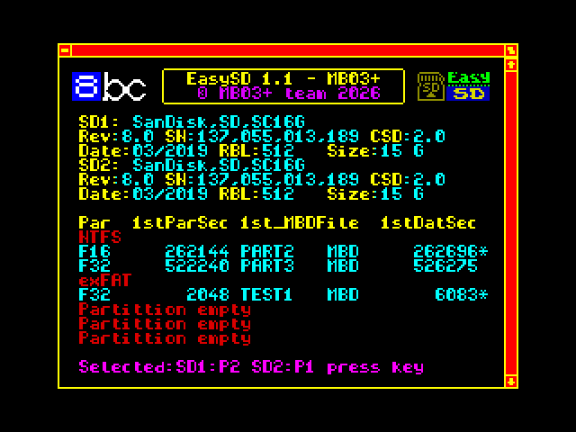
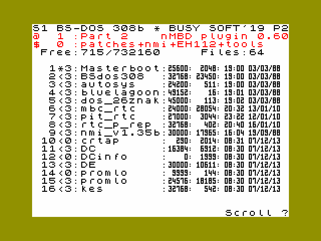

# EasySD 1.1

EasySD 1.1 adds runtime switching between **EasyCF**, SD1 and SD2 on MB03+ without resetting BSDOS or losing normal RAM contents.

It supports both MB03+ SD slots, keeps separate partition settings for SD1 and SD2, and includes a simple BASIC switcher. EasyCF 1.0.1 remains the current CF package; there is no separate EasyCF 1.1 release.

The EasyCF 1.0 and 1.0.1 drivers have the same CF functionality. The 1.0.1 distribution added only two launcher TAP files for MB03+ Slim and standalone eLeMeNt ZX.



## Highlights

- runtime switching between EasyCF, SD1 and SD2
- independent SD1 and SD2 detection and partition selection
- support for systems containing one or two SD cards
- automatic selection of usable SD partitions
- manual eight-row partition selector with a full-width cursor
- safe fallback when a configured partition value is outside P1-P4
- safe rejection of missing devices and unusable partitions
- BASIC switcher with current-system and availability reporting
- `KILLX` after switching to invalidate cached disk information
- active device and partition displayed in the BSDOS catalogue corners
- write-protection symbol displayed only next to the disk number
- compatible EasyCF check before the installer touches SD hardware
- configurable EasySD SRAM page in the physical range 6-32

## Downloads

- [EasySD 1.1 complete ZIP](https://github.com/milan-stava/EasySD/releases/download/v1.1/EasySD_EasyCF_v1.1.zip)
- [EasySD 1.1 installer](https://github.com/milan-stava/EasySD/releases/download/v1.1/EasySD_1_1_INSTALL.tap)
- [CF/SD1/SD2 switcher](https://github.com/milan-stava/EasySD/releases/download/v1.1/SWITCH_MENU.tap)
- [EasySD 1.1 release page](https://github.com/milan-stava/EasySD/releases/tag/v1.1)
- [Required EasyCF 1.0.1 release](https://github.com/milan-stava/EasyCF/releases/tag/v1.0.1)
- [EasyCF 1.0.1 complete ZIP](https://github.com/milan-stava/EasyCF/releases/download/v1.0.1/EasyCF_v1.0.1.zip)

## Requirements and compatibility

EasySD 1.1 requires:

- full MB03+
- BSDOS 3.08
- compatible EasyCF installed in physical SRAM page 2 (write mapping value 98); the current distribution is EasyCF 1.0.1

The installer verifies the existing internal `EasyCF10` identifier and the required bank-switching entry before accessing either SD card. This is a compatibility check, not a separate EasyCF version. If the check fails, it displays `EasyCF required` and exits without modifying BSDOS.

Version 1.1 is not intended for a standalone eLeMeNt ZX or MB03+ Slim. Continue using [EasySD 1.0.1](https://github.com/milan-stava/EasySD/releases/tag/v1.0.1) on those platforms.

## Installation

1. Install and verify EasyCF; use the current EasyCF 1.0.1 package.
2. Run `EasySD_1_1_INSTALL.tap`.
3. Check the detected SD1 and SD2 cards and their partitions.
4. Confirm the automatic selection, or hold SPACE during scanning for manual selection.
5. Run `SWITCH_MENU.tap` whenever CF/SD1/SD2 switching is required.

The menu marks an unavailable target as `NOT DETECTED` and refuses to switch to it. Before a complete installation it can identify a legacy EasyHDD, EasyCF or EasySD system, but runtime switching remains disabled.

## Partition selection

EasySD 1.1 stores one preferred physical partition for each SD slot. Valid values are P1-P4. The final selection routine validates each setting separately:

- SD1 searches only SD1 P1-P4;
- SD2 searches only SD2 P1-P4;
- values outside 1-4 safely fall back to the first usable partition on the same card;
- if no usable partition exists, that card is not selected.

Manual mode is requested by holding SPACE during the initial scan. The cursor then visits all eight fixed rows. ENTER toggles a usable blue partition, red entries are ignored, SPACE confirms and EDIT exits.

## Runtime switcher


The shared machine-code switcher is loaded at `#8000`:

| Address | Decimal | Function |
| --- | ---: | --- |
| `#8000` | 32768 | switch to CF |
| `#8003` | 32771 | switch to SD1 |
| `#8007` | 32775 | switch to SD2 |
| `#800B` | 32779 | return current system in BC |
| `#800E` | 32782 | return availability mask in BC |

The availability mask uses bit 0 for CF, bit 1 for SD1 and bit 2 for SD2. Switching returns `BC=0` on success and `BC=1` when the target is unavailable.

After a successful switch, the code calls BSDOS service `KILLX` to invalidate cached information about the previously used disk.

## BSDOS catalogue



The active device is displayed as `CF`, `S1` or `S2` in the top-left catalogue corner. The active physical partition `P1`-`P4` is displayed at top right. A write-protection lock appears only immediately after the protected BSDOS disk number.

## MB03+ BOOT support for SD2

The updated [MB03+ BOOT](https://github.com/milan-stava/mb03plusboot) initializes both SD1 and SD2. It fixes returning through BOOT function `E` when SD2 was the last active device. Users of EasySD 1.1 should use this new dual-SD BOOT version.

## Building

Build version 1.1 with:

```text
compile_1_1.bat
```

or on Linux:

```text
./compile_1_1.sh
```

Required tools:

- SjASMPlus 1.20.3 or compatible
- Python 3 for TAP generation

The build produces:

- `EasySD_1_1_INSTALL.tap`
- `SWITCH_MENU.tap`

Assembler listings, raw binaries and TAP files are build artifacts and are excluded from Git.

## Testing

EasySD 1.1 was tested on real MB03+ hardware with EasyCF 1.0.1, SD1 and SD2. Tests covered runtime switching, one-card and two-card configurations, automatic and manual partition selection, repeated catalogues, LOAD/SAVE, non-empty `.SEARCH`, write-protection display and unavailable-target rejection.

## Documentation

- [Czech HTML manual](https://hood.speccy.cz/dwnld/EasySD_CF_infoCZ.html)
- [English HTML manual](https://hood.speccy.cz/dwnld/EasySD_CF_infoEN.html)
- [German HTML manual](https://hood.speccy.cz/dwnld/EasySD_CF_infoDE.html)

The release package also contains `RELEASE_NOTES_1.1.md`.
