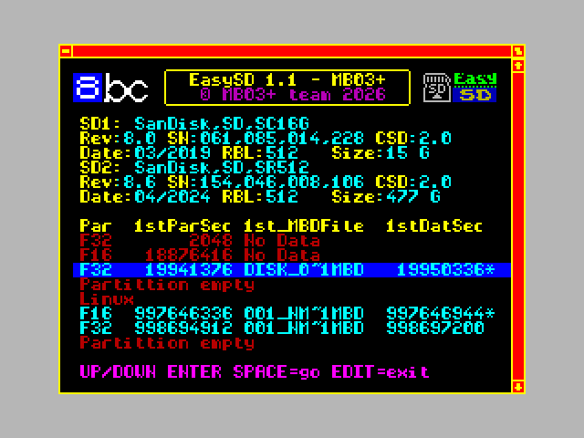
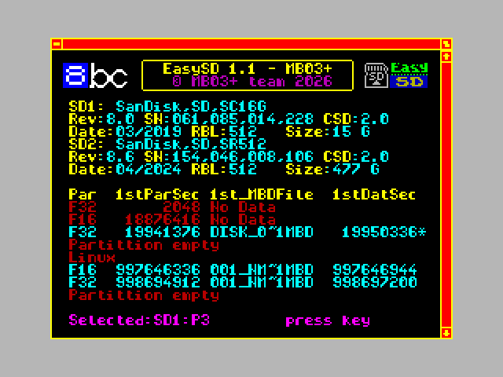

# EasySD

EasySD is a BSDOS utility for ZX Spectrum computers with MB03+, MB03+ Slim or eLeMeNt ZX. It finds BSDOS MBD/MBH disk images stored on FAT16/FAT32 SD media and configures BSDOS without requiring the user to calculate physical sector locations.

## EasySD 1.1

EasySD 1.1 extends a full MB03+ with runtime switching between CF, SD1 and SD2. Switching does not restart BSDOS and preserves normal RAM contents.

  
  

  

Main features:

- independent detection of both MB03+ SD slots
- automatic and manual partition selection
- configurations with one or two inserted SD cards
- Basic Switcher 1.0 for CF / SD1 / SD2
- FULL Switcher 1.1 for CF / SD1 / SD2 and P1-P4
- 26-character user-defined partition names
- active device, partition and write-protection indication in the BSDOS catalogue
- rejection of unavailable devices and invalid partitions

For combined operation install **EasyCF 1.1 first**, then run `EasySD_1_1_INSTALL.tap`.

### Stable downloads

- [EasySD_EasyCF_v1.1.zip](https://github.com/milan-stava/EasySD/releases/download/v1.1/EasySD_EasyCF_v1.1.zip) - complete package with the installer, both switchers and CZ/EN/DE documentation
- [EasySD_1_1_INSTALL.tap](https://github.com/milan-stava/EasySD/releases/download/v1.1/EasySD_1_1_INSTALL.tap) - EasySD 1.1 installer for a full MB03+
- [SWITCH_MENU.tap](https://github.com/milan-stava/EasySD/releases/download/v1.1/SWITCH_MENU.tap) - Basic Switcher 1.0
- [EasySD / EasyCF 1.1 release](https://github.com/milan-stava/EasySD/releases/tag/v1.1)

The FULL Switcher 1.1 is included in the complete ZIP and its source is available under `ver 1.1/switchers/Switcher_1.1_Full`.

## EasySD 1.0.1

EasySD 1.0.1 remains available for MB03+, MB03+ Slim and standalone eLeMeNt ZX:

- [EasySD 1.0.1 release](https://github.com/milan-stava/EasySD/releases/tag/v1.0.1)
- [EasySD_v1.0.1.zip](https://github.com/milan-stava/EasySD/releases/download/v1.0.1/EasySD_v1.0.1.zip)

## Documentation

- [English](https://hood.speccy.cz/dwnld/EasySD_CF_infoEN.html)
- [Czech](https://hood.speccy.cz/dwnld/EasySD_CF_infoCZ.html)
- [German](https://hood.speccy.cz/dwnld/EasySD_CF_infoDE.html)

## Source code

The repository stores each public generation separately:

- `ver 1.0`
- `ver 1.0.1`
- `ver 1.1`

Windows builds use `compile.bat`; Linux builds use `compile.sh` where available. Switchers in version 1.1 are built separately in their own directories.

---

EasySD is an unofficial community project for BSDOS / MB03+ / eLeMeNt ZX.
