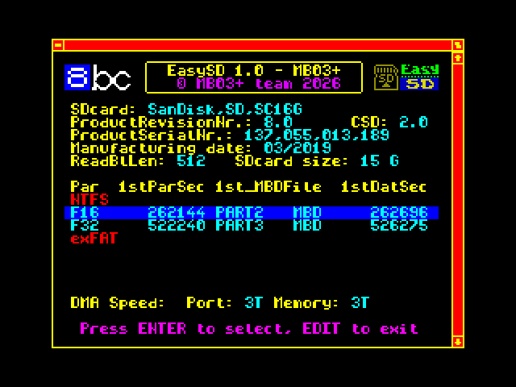

\# EasySD 1.0

EasySD 1.0 is the first public release of EasySD for BSDOS.

EasySD automatically detects supported FAT16/FAT32 partitions, locates MBD/MBH disk images and configures BSDOS without requiring the user to know their physical sector location.

\## Supported hardware

\- MB03+

\- eLeMeNt ZX

\## Main features

\- FAT16 and FAT32 support

\- up to four primary partitions

\- superfloppy FAT16/FAT32 media support

\- automatic and manual partition selection

\- SPACE override for temporary MANUAL mode

\- BSDOS disks 1–255

\- MBD and MBH image support

\- automatic calculation of the physical LBA of the first BSDOS disk

\- per-disk write protection

\- SDHC and SDXC support

\- SD initialization with timeout and retry handling

\- FAT32 root-directory preparation tools for Windows and Linux

\## Downloads

The current release is available in the GitHub Releases section.

Release package contents:

\- `EasySD\_MB\_BIN.tap` – EasySD for MB03+

\- `EasySD\_EL.tap` – EasySD for standalone eLeMeNt ZX

\- `EasySD\_documentation.txt` – complete user and technical manual

\- `PREPARE\_EASY\_FAT32.bat` – FAT32 preparation tool for Windows

\- `PREPARE\_EASY\_FAT32.sh` – FAT32 preparation tool for Linux

\- `EasySD\_v1.0.zip` – complete release package

\## Important

MBD/MBH disk images must form one physically contiguous area on the media.

Version 1.0 has been tested on real MB03+ and eLeMeNt ZX hardware, including BSDOS read and write operations.

\## Documentation

See `EasySD\_documentation.txt` for the complete user and technical manual.

### Complete package

[**Download EasySD v1.0 ZIP**](https://github.com/milan-stava/EasySD/releases/download/v1.0/EasySD_v1.0.zip)

### Individual files

- [EasySD_MB_BIN.tap](https://github.com/milan-stava/EasySD/releases/download/v1.0/EasySD_MB_BIN.tap) – EasySD for MB03+
- [EasySD_EL.tap](https://github.com/milan-stava/EasySD/releases/download/v1.0/EasySD_EL.tap) – EasySD for standalone eLeMeNt ZX
- [EasySD_documentation.txt](https://github.com/milan-stava/EasySD/releases/download/v1.0/EasySD_documentation.txt) – complete manual
- [PREPARE_EASY_FAT32.bat](https://github.com/milan-stava/EasySD/releases/download/v1.0/PREPARE_EASY_FAT32.bat) – Windows FAT32 preparation tool
- [PREPARE_EASY_FAT32.sh](https://github.com/milan-stava/EasySD/releases/download/v1.0/PREPARE_EASY_FAT32.sh) – Linux FAT32 preparation tool

See the [EasySD 1.0 release](https://github.com/milan-stava/EasySD/releases/tag/v1.0) for release notes.

\## Related project

EasyCF is the CompactFlash counterpart of EasySD for MB03+.

## Official website

Full HTML documentation, screenshots and project information:

- [English documentation](https://hood.speccy.cz/dwnld/EasySD_CF_infoEN.html)
- [Czech documentation](https://hood.speccy.cz/dwnld/EasySD_CF_infoCZ.html)
- [German documentation](https://hood.speccy.cz/dwnld/EasySD_CF_infoDE.html)

